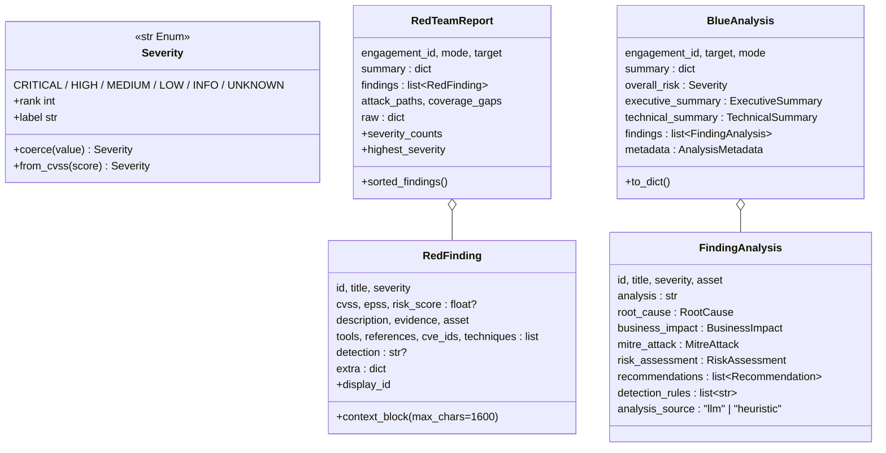
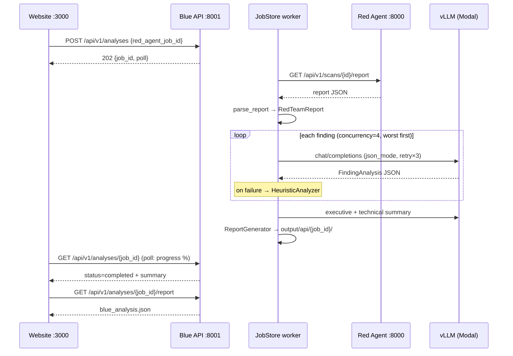

# BlueAgent — Low-Level Design (LLD)

> Companion to [`HLD.excalidraw`](HLD.excalidraw) (open at [excalidraw.com](https://excalidraw.com)
> or with the VS Code Excalidraw extension). The HLD shows the system boundaries;
> this document specifies every module, class, contract, and flow inside them.

---

## 1. System overview

The Blue Team Analysis Agent consumes a Red Agent JSON findings report, reasons over
every finding with an LLM (Modal-hosted vLLM by default), and emits:

- `blue_analysis.json` — structured record for dashboards/ticketing
- `blue_report.md` — human-readable executive-grade report

**Hard constraint:** the agent performs no scanning and never contacts a target.
Its only input is a JSON document.

### Design invariants

| # | Rule | Enforced by |
|---|------|-------------|
| 1 | One LLM boundary — only `services/llm.py` performs inference | All other modules depend on `LLMService` |
| 2 | Prompts are data, never inline in logic | `prompts/blue_analysis_prompt.py` |
| 3 | Only `config.py` reads `os.environ` | `Settings.from_env()` is the single entry |
| 4 | Degrade, don't die — every LLM path has a deterministic fallback | `HeuristicAnalyzer` + `allow_offline_fallback` |
| 5 | Never lose input — unrecognised report fields are preserved | `RedFinding.extra`, `RedTeamReport.raw` |

---

## 2. Module map

```
app.py                    CLI entry point + pipeline orchestration (exit codes 0/2/3/4)
serve_api.py              uvicorn launcher for the HTTP API (0.0.0.0:8001)
config.py                 Settings (frozen pydantic model) — sole reader of the environment
modal_app.py              Modal deployment: analyze_report() function + `web` HTTPS endpoint

api/
  server.py               Starlette routes + CORS — HTTP concerns only
  jobs.py                 AnalysisRequest, JobStore, Red Agent handoff — job lifecycle

services/
  parser.py               Red Agent JSON → RedTeamReport (schema-drift tolerant)
  llm.py                  LLMService + provider registry — the ONLY LLM caller
  heuristics.py           HeuristicAnalyzer — 11 rule-based playbooks
  mitre.py                Offline ATT&CK catalog: lookup, enrich, keyword mapping
  report_generator.py     BlueAnalysis → JSON + Markdown (pure rendering)

prompts/
  blue_analysis_prompt.py SYSTEM_PROMPT, JSON schemas, build_* helpers (PROMPT_VERSION)

models/schemas.py         Pydantic contracts, inbound and outbound
utils/logger.py           loguru + rich console
tests/                    98 offline tests (fake providers, Red Agent stub)
```

---

## 3. Data contracts (`models/schemas.py`)

Two families: **inbound** (the normalised Red Agent view) and **outbound** (the Blue
deliverable). Outbound models are permissive about *content* (free text from the LLM)
and strict about *structure*, so a malformed model reply degrades one section instead
of failing the run. All models use `ConfigDict(extra="allow")`.



Key value objects:

| Model | Fields | Notes |
|---|---|---|
| `RootCause` | `primary`, `categories[]`, `explanation` | Categories from the prompt's fixed vocabulary (misconfiguration, missing patch, …) |
| `BusinessImpact` | 12 dimensions (CIA, financial, compliance, …) + `narrative` | All free text |
| `MitreAttack` | `tactics[]`, `techniques[{id,name,tactic,rationale}]`, `notes` | Empty mapping + note is a valid answer |
| `RiskAssessment` | `overall_risk_score` (clamped 0–10), `likelihood`, `impact`, `priority` (P0–P3), `risk_category`, `reasoning` | Score coerced/clamped in a `before` validator |
| `Recommendation` | `horizon` (immediate/short_term/long_term, normalised), `category` (patch/configuration/…/architecture), `action`, `rationale`, `effort` | Horizon aliases (`now`, `urgent`, `strategic`…) normalised |
| `AnalysisMetadata` | `generated_at`, provider/model, `findings_analysed`, `llm_analysed`, `heuristic_analysed`, `degraded`, `prompt_version` | `degraded=true` ⇔ any heuristic fallback occurred |

**Severity coercion** (`Severity.coerce`) accepts: enum members, alias strings
(`crit`, `sev1`, `p0`, `moderate`, `informational`, …), and bare numbers/numeric
strings bucketed by the CVSS v3.1 scale (`≥9.0` critical, `≥7.0` high, `≥4.0` medium,
`>0` low, else info).

---

## 4. Configuration (`config.py`)

`Settings` is a **frozen** pydantic model (`extra="forbid"`). Construction order:
`.env` (project root, then CWD) → process environment → keyword overrides
(CLI flags / API options); `None` overrides are discarded.

Environment variables resolve through **alias chains** so the agent shares an
environment file with the Red Agent unchanged:

| Setting | Env aliases (first non-empty wins) | Default |
|---|---|---|
| `llm_provider` | `LLM_PROVIDER`, `BLUE_LLM_PROVIDER` | `modal` |
| `llm_base_url` | `MODAL_LLM_BASE_URL`, `MODAL_ENDPOINT_URL`, `LLM_BASE_URL`, `SAFEGUARD_LLM_BASE_URL`, `OPENAI_BASE_URL` | — |
| `llm_api_key` | `MODAL_API_KEY`, `LLM_API_KEY`, `SAFEGUARD_LLM_API_KEY`, `OPENAI_API_KEY` | — |
| `model_name` | `MODEL_NAME`, `LLM_MODEL`, `SAFEGUARD_LLM_MODEL` | `qwen3-32b` |
| `temperature` | `TEMPERATURE`, `LLM_TEMPERATURE` | `0.2` (clamped 0–2) |
| `max_tokens` | `MAX_TOKENS`, `LLM_MAX_TOKENS` | `4096` |
| `enable_thinking` | `ENABLE_THINKING` | `false` |
| `request_timeout` | `REQUEST_TIMEOUT` | `180.0` s (Modal cold starts) |
| `max_retries` / `retry_backoff_seconds` | `MAX_RETRIES` / `RETRY_BACKOFF_SECONDS` | `3` / `2.0` |
| `concurrency` | `CONCURRENCY` | `4` (min 1) |
| `allow_offline_fallback` | `ALLOW_OFFLINE_FALLBACK` | `true` |
| `input_path` / `output_dir` | `INPUT_PATH` / `OUTPUT_DIR` | `input/sample_report.json` / `output/` |

Validators: provider must be one of `modal | openai | vllm | ollama | azure | offline`;
`llm_base_url` is normalised to always end in `/v1` (the most common misconfiguration).
`Settings.llm_configured` is true when provider ≠ offline **and** a base URL is set.

---

## 5. Parser (`services/parser.py`)

The only module that knows the Red Agent schema is unstable. Contract:

- **Alias chains** per field, ordered by preference — e.g. description resolves
  through `description / desc / details / detail / summary / explanation / impact`;
  tool through `tool / tools / sources / source / scanner / engine / plugin`.
  `_first()` also looks one level into `info / metadata / meta / details / attributes`.
- **Findings location**: `findings / vulnerabilities / issues / results / items` as a
  list, a dict keyed by ID (values taken), or nested inside any envelope object
  (recursive shallow search). A bare top-level JSON array is treated as the findings
  list itself.
- **Coercion helpers**: `_as_text` (flattens any JSON value, bounded length),
  `_as_str_list` (de-duplicated), `_as_float` (accepts `8.8`, `"8.8"`,
  `{"base_score": 8.8}`, first numeric in a list), `_normalise_cves`
  (keeps only `CVE-*`, upper-cased), `_normalise_techniques` (extracts
  `T1190` / `T1059.001`-shaped tokens from any shape).
- **Severity**: label coerced via `Severity.coerce`; if UNKNOWN but a CVSS score
  exists, severity is inferred from the score.
- **Nothing is dropped**: keys not consumed by the alias chains land in
  `RedFinding.extra`; the whole input document is kept in `RedTeamReport.raw`.
- **Target derivation**: explicit target keys first; otherwise the most frequently
  referenced finding asset.
- **Errors**: only `ReportParseError` (unreadable file, malformed JSON, top-level
  value that is neither object nor list). A finding with no recognised fields still
  becomes a finding (`finding-N` / `Finding N` defaults).

Entry points: `parse_report(source)` where `source` is a `Path`, a JSON string, or an
already-decoded dict/list; `ReportParser` is a thin DI-friendly wrapper. File loads
use `orjson`, string loads `json`.

---

## 6. LLM layer (`services/llm.py`)

### 6.1 Layering

```
LLMService                 orchestration, prompt selection, validation, fallback
  BaseLLMProvider          transport contract: complete(messages, temperature, max_tokens, json_mode) -> str
    OpenAICompatibleProvider   urllib-based HTTP client for any OpenAI-dialect endpoint
    OfflineProvider            available=False; every call raises LLMError
PROVIDERS registry         {"modal"|"openai"|"vllm"|"ollama"|"azure": OpenAICompatibleProvider, "offline": OfflineProvider}
```

`build_provider(settings)` returns `OfflineProvider` when the provider is `offline`
**or** no base URL is configured — a missing `.env` degrades instead of crashing.
Providers are transport-only; they know nothing about prompts or findings. Adding a
non-OpenAI dialect = implement `complete` + register in `PROVIDERS`; no other module
changes.

### 6.2 `OpenAICompatibleProvider.complete`

- `POST {base_url}/chat/completions` with `model`, `messages`, `temperature`,
  `max_tokens`; always sends `chat_template_kwargs: {enable_thinking: …}`
  (vLLM/Qwen hybrid-reasoning toggle — must be top-level, `extra_body` is ignored);
  `response_format: {"type": "json_object"}` when `json_mode=True`.
- `Authorization: Bearer <key>` when an API key is configured.
- Raises `LLMError` on: HTTP error (detail truncated to 400 chars), URL/timeout/OS
  error, non-JSON envelope, unexpected response shape, or **empty content**
  (reasoning models can burn the whole budget on the thinking trace with
  `finish_reason="length"` — the error message says to raise `MAX_TOKENS` or set
  `ENABLE_THINKING=false`).
- Uses stdlib `urllib` deliberately — no SDK, minimal container surface.

### 6.3 JSON repair — `extract_json_object(text)`

Models wrap JSON in prose/fences despite instructions. Repair order:

1. Strip everything before a trailing `</think>` block.
2. Strip ``` fences (with optional `json` language tag).
3. Try `json.loads` on the whole cleaned text.
4. Otherwise scan for the first **balanced `{…}` span** — string- and escape-aware —
   and parse it; on failure advance to the next `{`.
5. Raise `LLMError` if no object parses.

### 6.4 `LLMService`

Public surface: `analyze_finding`, `analyze_findings`, `generate_executive_summary`,
`generate_technical_summary`, `generate_summary`, `generate_report`, `llm_available`.

**`_chat(prompt, json_mode=True)`** — one prompt → parsed JSON object with retries:
messages are `[system: build_system_prompt(), user: prompt]`; up to
`max_retries` attempts with exponential backoff (`retry_backoff_seconds · 2^(n-1)`);
raises `LLMError` after the final failure.

**`analyze_finding(finding, report, position)`**
1. If provider unavailable → `HeuristicAnalyzer.analyze_finding` directly.
2. Build prompt from `finding.context_block()` (compact key–value rendering,
   evidence truncated to 1600 chars) + engagement context.
3. `_chat` → payload → `_finding_from_payload`:
   - **Identity fields (`id`, `title`, `severity`, `asset`) are stamped from the
     report, never trusted from the model**, so every analysis traces back to its
     source finding; `analysis_source="llm"`.
   - Validate with `FindingAnalysis.model_validate`; empty analysis body is an error.
   - `_enrich_mitre`: every technique ID is looked up in the offline catalog
     (names/tactics filled in, de-duplicated); **scanner-asserted techniques that the
     model dropped are merged back in** with an explicit rationale; tactics list is
     completed from the techniques; an empty mapping gets an explanatory note.
4. On `LLMError`/`ValidationError`: re-raise if `allow_offline_fallback=False`,
   else log and fall back to the heuristic analyser for that finding only.

**`analyze_findings(report, progress)`** — findings sorted worst-first
(severity rank, then CVSS, then Red Agent risk score), analysed with a
`ThreadPoolExecutor` of `min(concurrency, total)` workers. `_ProgressCounter` is a
lock-guarded counter that invokes the `(completed, total)` callback once per finished
finding; callback exceptions are swallowed (telemetry must never fail the run).
Result order matches the sorted findings regardless of completion order.

**Summaries** — `generate_executive_summary` / `generate_technical_summary` feed a
digest of the per-finding analyses (max 25 bullets: severity, title, asset, risk
score, priority, root cause) plus a root-cause frequency table into their prompts;
each independently falls back to the heuristic version.

**`generate_report(report, progress)`** — the full pipeline:
findings → summaries → `BlueAnalysis` assembly. The `summary` block is computed
(severity/priority counts, max/mean risk score, immediate-action count, tactics
observed, Red Agent's own summary). `overall_risk` = the worse of
`Severity.from_cvss(peak risk score)` and the peak per-finding severity.
Metadata records provider, model, LLM-vs-heuristic counts, `degraded`,
`prompt_version`.

---

## 7. Heuristic fallback (`services/heuristics.py`)

Produces the **same `FindingAnalysis` shape** from deterministic playbooks, tagged
`analysis_source="heuristic"`. It is also the reference for what a "complete"
analysis looks like.

- `Playbook` (frozen dataclass): `name`, `pattern` (regex matched against
  title+description+evidence), `root_cause`, `categories`, `analysis` prose,
  `impact` dict, `recommendations` (horizon, category, action, rationale),
  `detections`.
- 11 playbooks: `tls_certificate`, `weak_crypto`, `missing_headers`, `injection`,
  `default_credentials`, `exposed_secrets`, `access_control`, `outdated_component`,
  `information_disclosure`, `network_exposure`, and a `generic` catch-all.
- Scoring: `_risk_score` derives 0–10 from CVSS when present, else severity band
  (nudged by EPSS/risk hints); `_likelihood` from EPSS/severity; `_priority` maps
  severity → P0–P3.
- MITRE mapping comes from `mitre.map_text(...)` keyword rules plus any
  scanner-asserted IDs.
- `HeuristicAnalyzer` exposes `analyze_finding`, `executive_summary`,
  `technical_summary` — mirroring the LLM surface so `LLMService` can substitute
  per-section.

## 8. MITRE catalog (`services/mitre.py`)

Curated offline subset of ATT&CK Enterprise (~50 techniques a web/infra scanner
actually surfaces), not a full mirror.

- `TechniqueInfo(id, name, tactic)` frozen dataclass; `TECHNIQUES` dict keyed by ID.
- `normalise_id` / `lookup` / `enrich` (unknown IDs become "Unmapped technique"),
- `map_text(*fragments, asserted=…)` — keyword regex table → plausible techniques
  for the no-LLM path; `tactics_for` rolls techniques up to unique tactics.
- Swap path: replace with a STIX-backed loader; the public functions are the contract.

## 9. Prompts (`prompts/blue_analysis_prompt.py`)

- `PROMPT_VERSION = "1.0.0"` — recorded in `AnalysisMetadata` for reproducibility.
- `SYSTEM_PROMPT` pins the role to *defensive* analysis: never scan/attack, never
  produce exploit code, ground claims in supplied evidence, be concrete, output
  JSON only.
- Each `build_*` helper (`finding_analysis`, `executive_summary`,
  `technical_summary`) embeds the exact JSON skeleton the service validates against,
  plus the fixed `ROOT_CAUSE_CATEGORIES` vocabulary.
- Rule: business logic never concatenates prompt text of its own.

## 10. Report generation (`services/report_generator.py`)

Pure rendering — reads the analysis object, writes files; no LLM, no network. The
Markdown can be regenerated from stored JSON at any time.

- `generate(analysis) -> {"json": Path, "markdown": Path}`
- `write_json` — orjson, `OPT_INDENT_2 | OPT_SORT_KEYS`
- `render_markdown` section order: header (badge + metadata table) → executive
  summary → risk register table → ATT&CK coverage roll-up → per-finding sections
  (analysis, root cause, impact table, MITRE table, risk, recommendations by horizon,
  detection rules, `analysis_source` disclosure) → technical summary → consolidated
  remediation roadmap (immediate 0–7 days / short term 1–4 weeks / long term
  1–2 quarters) → footer.

---

## 11. HTTP API (`api/server.py` + `api/jobs.py`)

### 11.1 Split of responsibilities

`server.py` owns HTTP only (routes, CORS, error JSON); `jobs.py` owns the job
lifecycle. An analysis takes seconds-to-minutes (one LLM call per finding + two
summary calls against a cold-starting endpoint), so the API is **async job + poll**:

```
GET    /health                              liveness + llm_configured/provider/model
GET    /api/v1/config                       capabilities; drives the UI form
POST   /api/v1/analyses                     -> 202 {job_id, status, links, poll}
GET    /api/v1/analyses?limit=N             recent jobs, newest first (1..200, default 50)
GET    /api/v1/analyses/{job_id}            status + progress + summary (no findings array — polling stays cheap)
GET    /api/v1/analyses/{job_id}/report     full blue_analysis.json (409 until completed)
GET    /api/v1/analyses/{job_id}/report.md  text/markdown; ?download=1 sets Content-Disposition
DELETE /api/v1/analyses/{job_id}            204; forgets the job and deletes artefacts
```

Ports: 3000 frontend · 8000 Red Agent · 8001 Blue Agent.

**CORS**: any loopback origin allowed by default (regex
`https?://(localhost|127.0.0.1|[::1])(:port)?` — dev servers hop ports);
`BLUE_API_CORS_ORIGINS` pins real origins for a deployment. Needed because
`application/json` forces preflight.

### 11.2 `AnalysisRequest`

Exactly **one** source per request:

| Source | Meaning |
|---|---|
| `report` | inline Red Agent document (dict or list) |
| `red_agent_job_id` (+ optional `red_agent_url`) | fetched server-side from `GET {red}/api/v1/scans/{id}/report` — the one-click path; the report never transits the browser |
| `report_path` | file on the Blue Agent host |

A **bare report posted directly** (detected via `findings`/`engagement_id`/
`posture`/`vulnerabilities` keys, with no envelope keys) is accepted as
`{report: body}` — piping Red Agent output straight in works.

`options` whitelist (`ALLOWED_OPTIONS`): `concurrency`, `temperature`, `max_tokens`,
`model_name`, `llm_provider`, `allow_offline_fallback`, plus `offline` (sugar for
`llm_provider=offline`). **Endpoint URL, API key, and timeouts are never
client-controllable.** Unknown fields/options → 422. `RequestError(message,
status_code)` carries the HTTP status.

`fetch_red_agent_report` maps upstream failures: 404 → 404 (unknown job), 409 → 409
(no report yet), other HTTP / unreachable / invalid JSON → 502 with a hint.

### 11.3 `JobStore`

Thread-safe in-memory registry + `ThreadPoolExecutor` (default 2 workers via
`BLUE_API_WORKERS`; history cap 200 via `BLUE_API_JOB_HISTORY`).

Job record: `job_id` (uuid4 hex), `status` (`queued → running → completed | error`),
timestamps, `source`, `progress {analysed, total, percent}`, `links`, `error`, and on
completion `overall_risk`, `summary`, `metadata`, `artifacts`, `analysis` (full doc,
stripped from list/status responses).

`_execute` (worker thread): resolve source → `parse_report` → record engagement
info → `LLMService(...).generate_report(report, progress=cb)` (the callback updates
the record under lock) → `ReportGenerator(ARTIFACT_ROOT/job_id).generate` → mark
completed. `RequestError`/`ReportParseError` → status `error` without traceback;
any other exception → `error` with a 5-frame traceback. A worker never dies silently.

Artefacts live in `output/api/<job_id>/` (`BLUE_API_ARTIFACT_DIR` overrides);
per-job directories keep results downloadable and non-colliding. Eviction drops the
oldest *finished* jobs past the history cap. Horizontal scaling = swap `JobStore`
for a Redis/DB implementation; the interface is deliberately small.

### 11.4 Sequence — one-click Red → Blue handoff



---

## 12. CLI (`app.py`)

`parse args → Settings.from_env(overrides) → configure_logging → run_analysis
(parse → LLMService.generate_report → ReportGenerator) → rich console summary`
(risk panel, risk-register table, top risks, artefact paths; `--quiet` suppresses).

| Exit code | Meaning |
|---|---|
| 0 | success |
| 2 | bad usage / missing input file |
| 3 | `ReportParseError` |
| 4 | runtime failure or interrupt |

Flags map 1:1 onto `Settings` fields; `--offline` forces `llm_provider=offline`;
`--no-fallback` sets `allow_offline_fallback=False` (fail rather than degrade).

## 13. Modal deployment (`modal_app.py`)

Deploys the *agent itself* (the LLM is a separate vLLM app). CPU-only
`debian_slim(python 3.12)` image with the project copied in
(`output`, `.git`, `.venv`, `.env` excluded) — a self-contained, reproducible
artefact. Secrets from `blue-agent-llm` (`MODAL_LLM_BASE_URL` required).

- `analyze_report(report, **settings_overrides)` — Modal function, callable via
  `modal.Function.from_name("blue-team-analysis-agent", "analyze_report").remote(...)`
- `web` — `@modal.fastapi_endpoint(method="POST")`: POST the Red Agent report JSON,
  receive `BlueAnalysis.to_dict()`
- `main` local entrypoint — `modal run modal_app.py` smoke test with the sample report

Both share `_analyze()`: `sys.path` bootstrap → `Settings.from_env` → `parse_report`
→ `LLMService.generate_report` → dict. `timeout=1800`, `max_containers=10`.

---

## 14. Error handling & resilience summary

| Failure | Behaviour |
|---|---|
| No `.env` / no base URL | `OfflineProvider` — heuristic run, warning logged |
| LLM cold start / timeout | 180 s timeout, 3 retries with exponential backoff (2 s · 2ⁿ) |
| All retries fail (one finding) | That finding falls back to heuristics; `metadata.degraded=true` |
| `--no-fallback` / option off | `LLMError`/`ValidationError` propagates; CLI exit 4, job status `error` |
| Model reply not valid JSON | Balanced-brace repair (`extract_json_object`); counts as attempt failure if unrecoverable |
| Model reply fails schema | `ValidationError` → fallback (identity fields were never model-controlled) |
| Unparseable input report | `ReportParseError` → exit 3 / job `error` |
| Unknown report schema | Parsed anyway — alias chains, defaults, `extra`/`raw` preservation |
| Red Agent unreachable | 502 with actionable message at job creation |
| Progress callback raises | Swallowed and logged |

Concurrency notes: finding-level parallelism is thread-based (blocking `urllib`
I/O); `JobStore` state is mutated only under `self._lock`; job records returned to
handlers are copies.

## 15. Extension points

| Change | Where |
|---|---|
| New LLM dialect (Anthropic Messages, Bedrock, …) | Subclass `BaseLLMProvider`, register in `PROVIDERS` |
| New root-cause class / remediation playbook | Add a `Playbook` in `services/heuristics.py` |
| More ATT&CK coverage | Extend `TECHNIQUES` in `services/mitre.py` (or swap in a STIX loader) |
| Analysis depth / tone | Edit `prompts/blue_analysis_prompt.py` (bump `PROMPT_VERSION`) |
| New report format (HTML, PDF, SARIF) | New renderer beside `ReportGenerator` — reads only `BlueAnalysis` |
| Horizontal API scaling | Replace `JobStore` with a Redis/DB-backed implementation |

## 16. Testing strategy

98 tests, all offline: fake providers exercise the LLM path (retry-then-succeed,
retry-then-fallback, JSON repair of messy replies), a stub stands in for the Red
Agent, and coverage spans schema-drift parsing, severity coercion, Markdown
structure, the CLI end-to-end, and every API route including CORS preflight and the
handoff. No credentials, no network.
